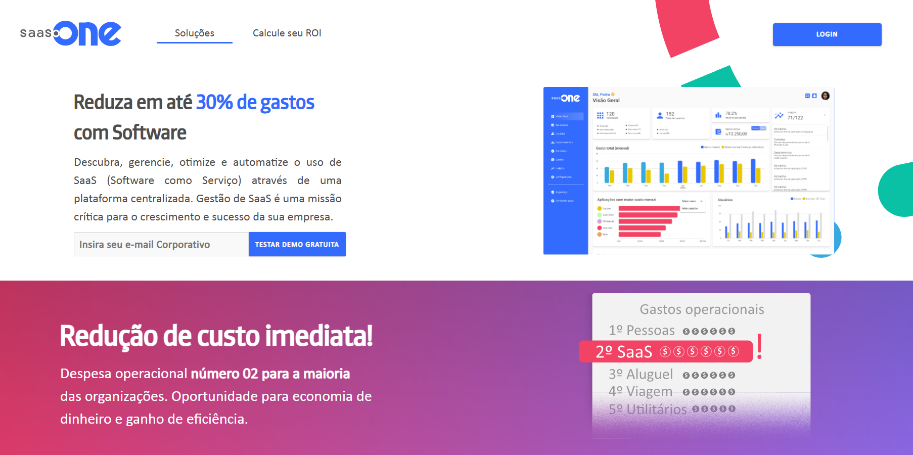

# Modern Portfolio Website

A sleek, responsive portfolio website built with Next.js 14, featuring dark theme, internationalization, and smooth animations. This portfolio showcases my projects, skills, and professional experience in an elegant and user-friendly interface.



## Features

- **Modern Tech Stack**: Built with Next.js 14, React 18, and TypeScript
- **Responsive Design**: Fully responsive layout that works beautifully on all devices
- **Dark Theme**: Elegant dark theme for optimal viewing experience
- **Internationalization**: Support for multiple languages:
  - English 
  - Portuguese 
  - Spanish 
  - French 
- **Smooth Animations**: Powered by Framer Motion for engaging user interactions
- **Project Showcase**: Dynamic project cards with filtering and sorting capabilities
- **Clean Architecture**: Follows SOLID principles and clean code practices

## Getting Started

### Prerequisites

- Node.js 18+ 
- npm or yarn

### Installation

1. Clone the repository
```bash
git clone https://github.com/ricardobezerra22/portfolio
cd portfolio
```

2. Install dependencies
```bash
npm install
# or
yarn install
```

3. Run the development server
```bash
npm run dev
# or
yarn dev
```

4. Open [http://localhost:3000](http://localhost:3000) in your browser

## Built With

- [Next.js](https://nextjs.org/) - React framework for production
- [React](https://reactjs.org/) - UI library
- [TypeScript](https://www.typescriptlang.org/) - Type safety
- [Tailwind CSS](https://tailwindcss.com/) - Styling
- [Framer Motion](https://www.framer.com/motion/) - Animations
- [Lucide Icons](https://lucide.dev/) - Beautiful icons

## Project Structure

```
portfolio/
├── app/                    # Next.js app directory
│   ├── i18n/              # Internationalization
│   ├── projects/          # Projects page
│   ├── books/             # Books page
│   └── resume/            # Resume page
├── components/            # Reusable components
├── public/               # Static assets
└── styles/              # Global styles
```

## Deployment

This project can be deployed on [Vercel](https://vercel.com) with zero configuration:

```bash
npm run build
# or
yarn build
```

## Contributing

Contributions, issues, and feature requests are welcome! Feel free to check [issues page](https://github.com/yourusername/portfolio/issues).

## License

This project is [MIT](https://choosealicense.com/licenses/mit/) licensed.

## Acknowledgments

- Next.js team for the amazing framework
- Vercel for the hosting platform
- All contributors and users of this project
